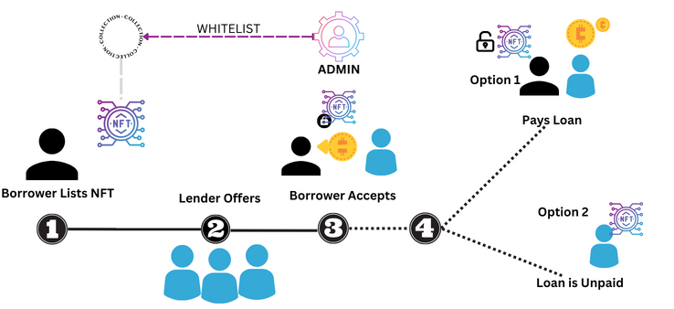

# borrow-lend-from-NFT
Borrow Lend Contract in Aptos blockchain by Mokshya Protocol

# Init

```
aptos init

```
# Publish

```
 aptos move publish  --named-addresses borrowlend=your_address

```
Copy the account address and replace in tests/borrowlend.ts

# Set Up
```
 npm install

```

# Run Test
```
yarn test
 
```